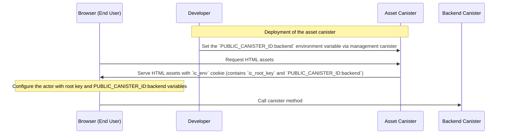

import { Aside } from '@astrojs/starlight/components';

This guide explains how a JavaScript client application can load the configuration served by the [asset canister](https://internetcomputer.org/docs/building-apps/frontends/using-an-asset-canister) using the `@icp-sdk/core` package.

<Aside>This guide assumes you are running your application in a browser environment, where the [`document.cookie`](https://developer.mozilla.org/en-US/docs/Web/API/Document/cookie) API is available.</Aside>

## Canister Environment

Before looking at the [usage](#usage), let's understand what canister environment variables are and how they are used by the asset canister.

Since [Proposal 138597](https://dashboard.internetcomputer.org/proposal/138597) was accepted, the Internet Computer network allows developers to set the environment variables for their canisters. The main goal of this feature is to allow developers to configure their canisters at runtime, without having to rebuild and redeploy their canisters.

Since [dfinity/sdk#4387](https://github.com/dfinity/sdk/pull/4387), the asset canister is leveraging this feature to serve some environment variables to the frontend application it hosts. The goal is the same: allow the frontend application to be built once and deployed once, and then configured at runtime. This unlocks use cases such as:

- Shipping your entire full-stack application as a single bundle and allowing anyone to install it on any subnet on the Internet Computer network
- Configuring your frontend application with just one canister call that does not require re-deployments
- Proposing frontends bundled within a single canister in a DAO framework

### Flow

Here's an overview of the environment variables flow



The flow is the following:

1. The developer deploys the backend canister.
2. The developer sets the `PUBLIC_CANISTER_ID:backend` environment variable to the backend canister ID via the management canister.
3. The browser of the end user requests the HTML assets from the asset canister.
4. The asset canister serves the HTML assets with the `ic_env` cookie. In this example, it serves the `ic_root_key` (by default, see [below](#the-ic_env-cookie)) and `PUBLIC_CANISTER_ID:backend` variables.
5. The browser of the end user decodes the `ic_env` cookie and configures the actor with the root key and `PUBLIC_CANISTER_ID:backend` variables.
6. The browser of the end user calls the canister method using the configured actor.

### The `ic_env` cookie

In order to serve the environment variables to the frontend application _synchronously_, the asset canister serves all the HTML assets with the `ic_env` cookie. The value of this cookie is an [URI-encoded](https://developer.mozilla.org/en-US/docs/Web/JavaScript/Reference/Global_Objects/encodeURIComponent) string of the environment variables. The value can be decoded using the [`decodeURIComponent`](https://developer.mozilla.org/en-US/docs/Web/JavaScript/Reference/Global_Objects/decodeURIComponent) function and mapped to a JavaScript object that can be used by the frontend application.

The `ic_env` cookie value contains the following properties:

- `ic_root_key`: the [root key](https://internetcomputer.org/docs/references/ic-interface-spec/#root-of-trust) of the Internet Computer network where the asset canister is deployed. It is always present in the cookie.
- any canister environment variable prefixed with `PUBLIC_`. A common case for the asset canister is to serve the `PUBLIC_CANISTER_ID:<canister-name>` environment variable, which allows the frontend application to know the canister ID to instantiate the [actor](https://js.icp.build/core/latest/libs/agent/api/classes/actor/) for.

## Usage

<Aside type="caution">The `@icp-sdk/core/agent/canister-env` module is experimental and may change in the future.</Aside>

In a frontend application, you can load the canister environment from the `ic_env` cookie using the `@icp-sdk/core` package. Specifically, you can use the [`getCanisterEnv`](./libs/agent/canister-env/api/functions/getCanisterEnv.md) function from the [`@icp-sdk/core/canister-env`](./libs/agent/canister-env/api/index.md) module to get the canister environment:

```typescript
import { getCanisterEnv } from "@icp-sdk/core/agent/canister-env";

const canisterEnv = getCanisterEnv();

console.log(getCanisterEnv.IC_ROOT_KEY); // served by default by the asset canister
```

You can also use the [`safeGetCanisterEnv`](./libs/agent/canister-env/api/functions/safeGetCanisterEnv.md) function to get the canister environment without throwing an error if the cookie is not present.

In order to preserve the type-safety at build time, you can pass a generic type parameter to the `getCanisterEnv` function to extend the `CanisterEnv` interface with your own environment variables:

```typescript
type MyCanisterEnv = {
  ['PUBLIC_CANISTER_ID:backend']: string;
}

const canisterEnv = getCanisterEnv<MyCanisterEnv>();

console.log(canisterEnv.IC_ROOT_KEY); // served by default by the asset canister
console.log(canisterEnv['PUBLIC_CANISTER_ID:backend']); // type-safe access to the environment variable
console.log(canisterEnv['PUBLIC_MY_PROPERTY']); // will fail to compile
```

You must make sure that the property names that you specify in the generic type parameter are set as canister environment variables on the asset canister (which will make them available in the `ic_env` cookie).

For more options on how to type the canister environment, see the [`CanisterEnv`](./libs/agent/canister-env/api/interfaces/CanisterEnv.md) interface documentation.

### Usage with an Actor

The canister environment is a convenient way to configure the [actor](https://js.icp.build/core/latest/libs/agent/api/classes/actor/) for the backend canister.

Assuming you have configured the asset canister with the `PUBLIC_CANISTER_ID:backend` environment variable, you can instantiate the actor as follows:

```typescript
import { getCanisterEnv } from "@icp-sdk/core/agent/canister-env";
import { createActor } from "./backend/api/hello_world"; // generated by the https://js.icp.build/bindgen tool

interface CanisterEnv {
  readonly "PUBLIC_CANISTER_ID:backend": string;
}

const canisterEnv = getCanisterEnv<CanisterEnv>();
const canisterId = canisterEnv["PUBLIC_CANISTER_ID:backend"];

const helloWorldActor = createActor(canisterId, {
  agentOptions: {
    rootKey: !import.meta.env.DEV ? canisterEnv.IC_ROOT_KEY : undefined,
    shouldFetchRootKey: import.meta.env.DEV,
  },
});

// Now you can call the backend canister methods
console.log(helloWorldActor.greet("World"));
```

This avoids having to pass environment variables to the actor at build time or fetching them before instantiating it.
